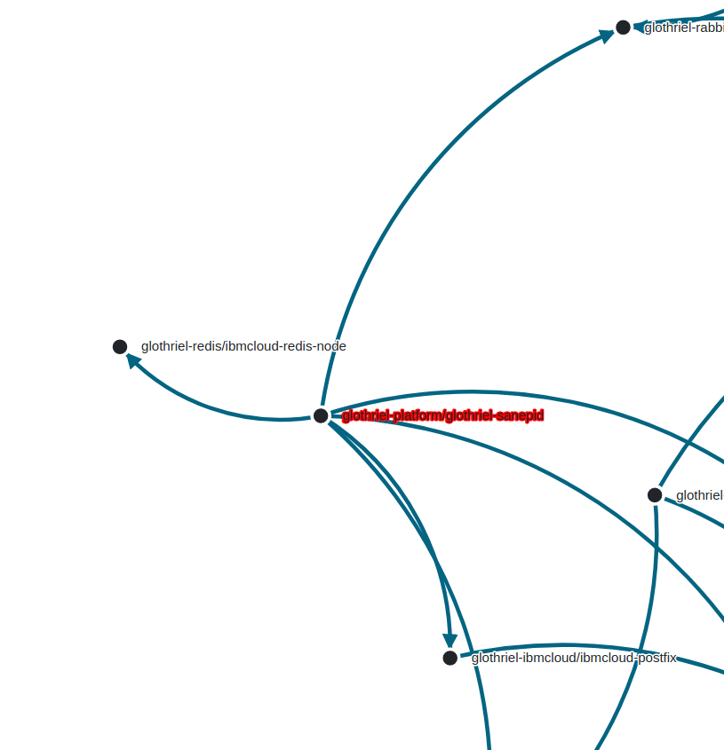
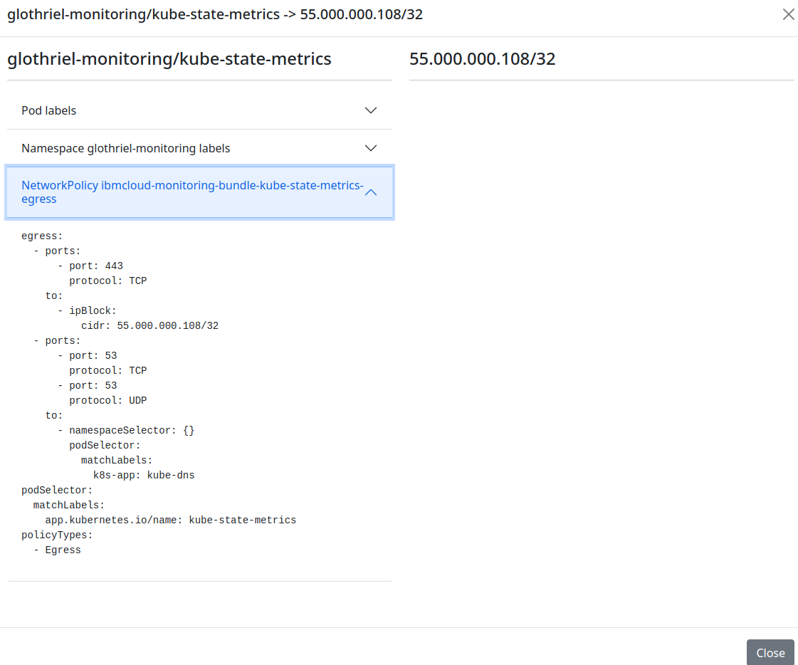

# npviz aka NetworkPolicy visualizer


Npviz is a simple utility, that connects to your kubernetes cluster using currently active kubectl context and allows viewing connections between pods using NetworkPolicy resources as source of truth.

Features:

* Show resource connection graph with drag & zoom, thanks to d3js demo + some random people on stack overflow
* Show connection details after clicking on the link
* Highlight workloads with no network policies attached using red font

Known bugs:

* The graph ignores ip cirds when calculating in cluster connections, for example using "0.0.0.0/0" allows connections to every destination, both in and out of the cluster. Currently all CIDRs are just represented as separate nodes.
* The graph will be buggy when interpreting network policies, that use both ingress and egress rules in one resource.

Plans for the future:

* Resolve the bugs
* Allow generating single-page HTML in order to be able to post it as artifact for CI builds

### License

MIT

### Screenshots

Graph view:



Connection details



### Usage

Download latest release and run the process `./npviz --server`. You can also just run in from code if you prefer, read more in Development section below.

Then go to `http://localhost:1337` and wait for several seconds until npviz obtains resources from your cluster. If some errors happens, search them in CLI stdout/err and web console via browser inspector.

If you'd like to load yaml resources from your local directory instead of downloading them from live cluster (if they were for example previously generated using helm template command), you can do so using `--from-directory` flag.


### Development

Clone this repository and invoke:

```
go run cmd/main.go server
```

As to contributions, just submit a PR if you feel so. It's a single weekend project and it's quite POCy in its nature. Maybe in time I'll post some more specific guides.